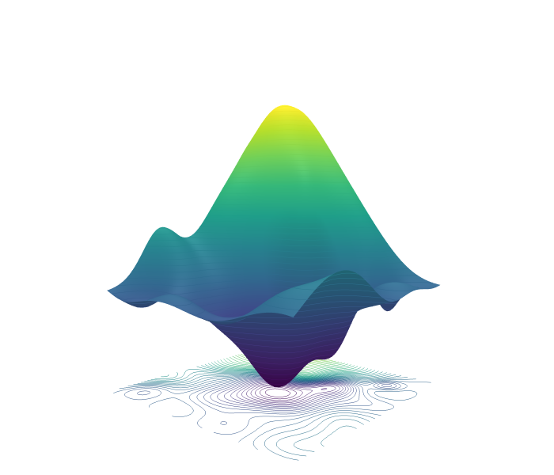

<h1 align="center">Towards a Latent Space Cartography of Subjective Experience in Mental Health.</h1>

<div align='center'>
    <a href='https://scholar.google.ca/citations?user=LxMWm1wAAAAJ&hl=en' target='_blank'><strong>Shawn Manuel</strong></a><sup> 1,2</sup>&emsp;
    <a href='https://scholar.google.com/citations?user=V_4V14gAAAAJ&hl=en&oi=ao' target='_blank'><strong>Frédéric Gosselin</strong></a><sup> 3</sup>&emsp;
    <a href='https://scholar.google.com/citations?user=XrBcghcAAAAJ&hl=en' target='_blank'><strong>Vincent Taschereau-Dumouchel</strong></a><sup> 1,2</sup>&emsp;
</div>

<div align='center'>
    <sup>1 </sup> Department of psychiatry and addictology, Université de Montréal
&emsp; <sup>2 </sup>Centre de recherche de l’institut universitaire en santé mentale de Montréal
&emsp; <sup>3 </sup>Department of psychology, Université de Montréal
&emsp;
</div>

<br>
<div align="center">
 <a href='https://arxiv.org'></a>
 <a href='https://deepprojection.pythonanywhere.com'></a>
 <a href='https://huggingface.co/spaces/shwnmnl/DeepProjection'></a>
</div>

<p align="center">
    
</p>

## Introduction

This repo, named DeepProjection, contains the code for our paper [Towards a Latent Space Cartography of Subjective Experience in Mental Health](https://arxiv.org). The latent space of subjective experiences can be explored on our [companion website](https://deepprojection.pythonanywhere.com), as well as the synthetic stimulus generation (hosted on [Hugging Face](https://huggingface.co/spaces/shwnmnl/DeepProjection)).

## Directory Structure

```
DeepProjection/
├── assets/
│ └── latentspace.pnq
├── src/
│ ├── clf.py
│ ├── fa.R
│ ├── gensynth.py
│ ├── plotting.py
│ └── scoring.py
├── LICENSE
├── README.md
└── requirements.txt
```

## Detailed Descriptions
- **assets/**: Contains image files used for this README file.
  - **latentspace.png**: Project emblem

- **src/**: Contains source code for the project.
  - **clf.py**: Script for valence and arousal classification, as well as mental health factors
  - **fa.R**: Script for factor analysis, including scree plot and factor loading plot
  - **gensynth.py**: Script for generating synthetic stimuli
  - **plotting.py**: Script for plotting results
  - **scoring.py**: Script for scoring questionnaires

- **LICENSE**: The license under which the project is distributed.

- **README.md**: The main README file you are currently reading.

- **requirements.txt**: Lists the Python packages required to run the project.